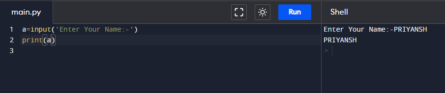
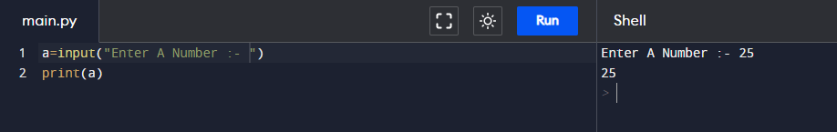
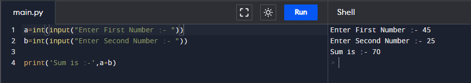
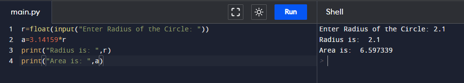
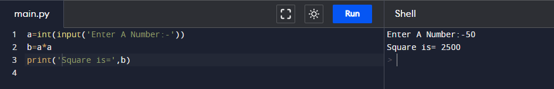
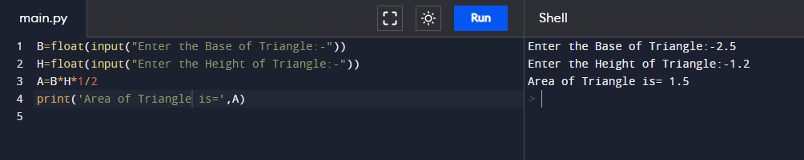
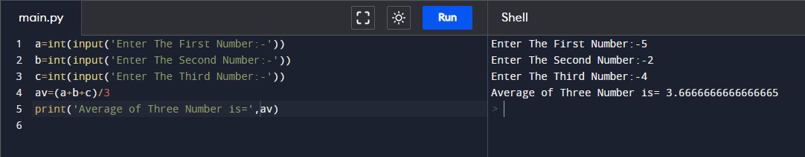
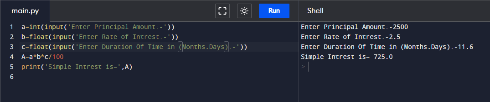
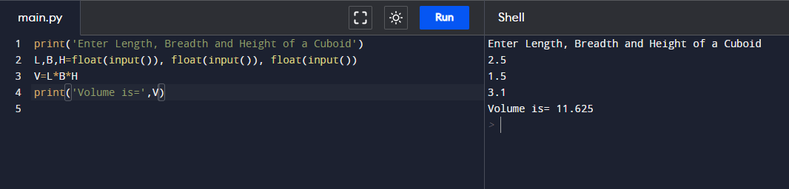
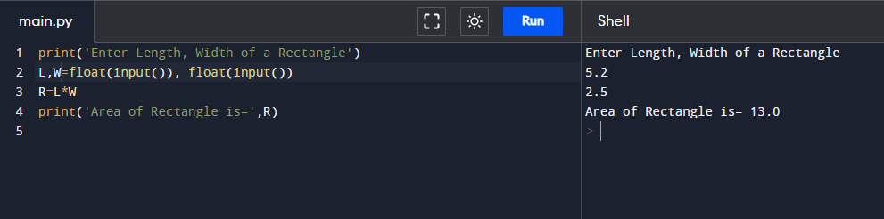

# Assignment - 4 Full Stack Web Development using Python MySirG User Input Problems.

    Qns 1. Write a python script to take your name as input from the user and then print it.

    Ans.

    Qns 2. Write a python script to take input from the user. Input must be a number.

    Ans.

    Qns 3. Write a python script which takes two numbers from the user, then calculate their sum and display the result.

    Ans.

    Qns 4. Write a python script which takes the radius from the user and display area of a circle.

    Ans. 

    Qns 5. Write a python script to calculate the square of a number. Number is entered by the user.

    Ans.

    Qns 6. Write a python script to calculate the area of Triangle. Number is entered by the user.

    Ans.

    Qns 7. Write a python script to calculate average of three numbers, entered by the user.

    Ans.

    Qns 8. Write a python script to calculate simple interest.

    Ans.

    Qns 9. Write a python script to calculate the volume of a cuboid.

    Ans.

    Qns 10. Write a python script to calculate area of a rectangle.

    Ans.
